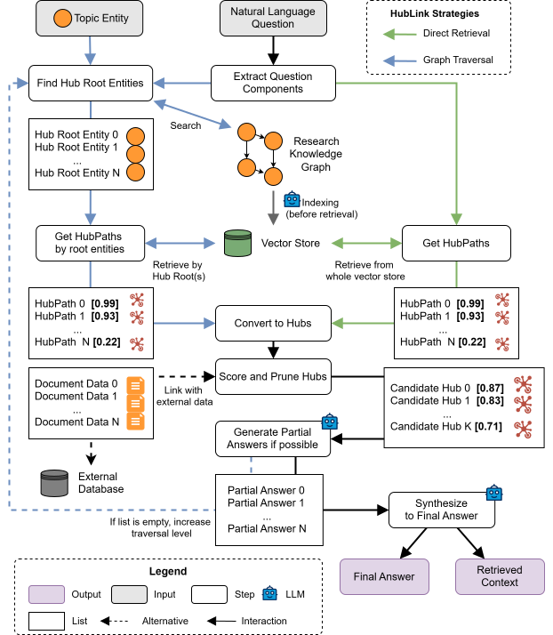

<div align="center">
<h2 align="center">HubLink: Leveraging Language Models for Enhanced Scholarly Information Retrieval on Research Knowledge Graphs<br/>
<i>Replication Package</i></h2><br/>
</div>

<div align="center">
<p>
    <a href='../../wikis/home'></a>

    
</p>

</div>

# About the Project

With the application of Large Language Models (LLMs) to academic search a potential emerged to reduce barriers to accessing information and speed up literature research tasks. However, LLMs face substantial limitations when faced with complex knowledge tasks that require deep and responsible reasoning. To solve this issue, Knowledge Graph Question Answering approaches intend to enrich the LLM with external information from a Knowledge Graph (KG) without retraining. But the application of KGQA approaches in the scholarly domain is still an underdeveloped area. We argue, that the application of LLMs can help researchers to find relevant information in a KG to speed up their research process and to improve the quality of their research. In our thesis, we propose HubLink, a novel approach that uses an LLM to reason on subgraphs without needing additional training or fine-tuning. It uses Hubs, which are special concepts utilized in the retrieval approach that hold particular significance for a specific domain or question. Hubs consolidate information and serve as pivotal points when searching for relevant data. To enrich answers with further information and ensure transparency, Hubs are additionally linked to source information. 

# Folder Structure

This project contains all the files of my master thesis. The folder structure is as follows:

```bash
.
├── Code    # The complete code for the thesis
├── Presentation    # The final presentation slides
└── Thesis    # The written thesis document
```

# Main Contribution: HubLink

My main contribution is the HubLink approach, which is a novel schema-agnostic and training-free approach designed for scholarly Knowledge Graph Question Answering (KGQA). HubLink utilizes pre-trained Large Language Models (LLMs) and operates by conceptually decomposing a Research Knowledge Graph (RKG) into hubs, which aggregate knowledge from individual publications. This structure facilitates source aware inference, thereby enhancing transparency and provenance tracking, which are crucial for scholarly tasks.

In the following, I will provide a short overview of the indexing and retrieval process of HubLink. If you are interested in the full details of the algorithm, please have a look at my thesis which is available in the [Thesis](./Thesis/master_thesis_marco_schneider_signed.pdf) folder.

### Indexing

The indexing process is illustrated in the image below. It begins with a set of start entities from the graph that serve as initial points for indexing. Using these entities, a search is performed with the goal of finding root entities of hubs. These are specific entities in the graph from which each hub is built. To find these roots, each possible path is traversed until either the end of the graph or until an entity in the graph is reached that is classified as the root of a hub. These identified entities are referred to as HubRoot objects, which are stored in a list to be processed sequentially.

For each identified HubRoot entity, the algorithm continues by finding and building the so-called HubPaths. These paths start from the HubRoot entity and lead to the end entities of a hub, which are either leaf nodes in the graph or other entities classified as roots of a hub. Both HubPaths and HubRoot form a Hub structure, which act as the central elements during retrieval.

Once the HubPaths of a hub are found, each path undergoes further processing before it can be indexed. First, the entire path is passed to an LLM to create a textual description of the path. In addition, an extraction of the triples, entities, and predicates from the path is performed. These pieces of information, the textual description, the triples, the entities, and the predicates, are then mapped into a low-dimensional vector space using a pre-trained embedding model. After this transformation, these vectors are stored in a vector store, which enables Approximate Nearest Neighbor search for fast access during the later retrieval stage. Furthermore, additional metadata are attached to each vector. This includes the root identifier of the hub for the identification of the hub to which the vector belongs and the description of the path that was generated previously by an LLM. This metadata is later required for the retrieval phase of the algorithm.

Once these hubs are indexed, the procedure repeats from the nodes in the graph that form the endpoints of each HubPath, provided they have not yet reached a leaf node. The indexing process stops until either the maximum number of traversal levels is reached or no new hubs are found.


### Retrieval

The HubLink retrieval and generation process is illustrated in the image below. The retriever offers two strategies for extracting relevant contexts from the Knowledge Graph (KG). The first strategy, _Direct Retrieval_, performs a global search on the whole index without requiring access to the graph during retrieval. The second strategy, named _Graph Traversal Retrieval_, performs a subgraph search that begins at a chosen entry point to explore the graph for the identification of relevant hubs to generate answers. The selection of the strategy involves balancing runtime and accuracy, a topic discussed later in this chapter. Both strategies differ only in certain parts of the retrieval algorithm, which we highlight by distinguishing the paths with different colors in the image below.

The retrieval begins with an extraction of components from the question. Here, an LLM is queried to extract the most relevant parts of the question as a list. This list of components and the question itself are then transformed into vectors using the same pre-trained embedding model used in the indexing phase. Now, depending on the strategy applied, the following steps differ:

__Graph Traversal Strategy:__ In addition to the question itself, this strategy requires as input a point of entry into the graph that is referred to as _Topic Entity_. The algorithm explores all paths starting at the topic entity to find HubRoot entities. After collecting these entities, an Approximate Nearest Neighbor (ANN) search is performed on the vector store for each collected root entity to find HubPaths that are relevant to the question and contain the root entity in their metadata. This process also involves a deduplication of the paths and the application of a diversity ranker to arrive at the paths that are considered relevant to the question.

__Direct Retrieval Strategy:__ Unlike the graph traversal strategy, the direct strategy does not require a topic entity for retrieval. Furthermore, during query time, this strategy does not impose any additional queries on the graph itself. Therefore, once the components are extracted from the question, the ANN search on the vector store is directly started, which involves querying the whole store instead of querying the hubs directly, as done by the traversal strategy. Before the strategy arrives at the final HubPaths, it includes further techniques like clustering by hubs, deduplication of paths, and the application of a diversity ranker.

The result of both strategies up until this point is a list of hubs with \(n\) HubPaths that the algorithm considers to be the most relevant to answer the question. The next step is to prune the hubs. This is done by aggregating the scores of the paths in each hub by calculating a weighted average. Only the top \(k\) hubs with the highest score are kept for the subsequent steps.

In the next step, the Linking process of the retriever begins. During this process, additional information is searched in an external database using the identifier of the hub, which further enriches the context of the hub beyond the knowledge collected from the graph. This could be, for example, text passages from the source publications.

By now, all necessary information about each hub has been collected. Next, for each hub, a \emph{partial answer} is generated based on the aggregated information from the hub. This is done by passing the information from the hub together with the original question in a prompt to an LLM. The LLM first checks if it is possible to provide a partial answer to the question based on this information and then provides the partial answer. If the list of partial answers is empty, no answer could be found for the question. At this step, the traversal strategy continues by traversing deeper into the graph. However, for the direct retrieval strategy, the process ends.

If partial answers have been generated, they are consolidated into a final answer. This is done by passing the partial answers to the LLM along with the original question. The LLM then generates the final answer based on this information.

